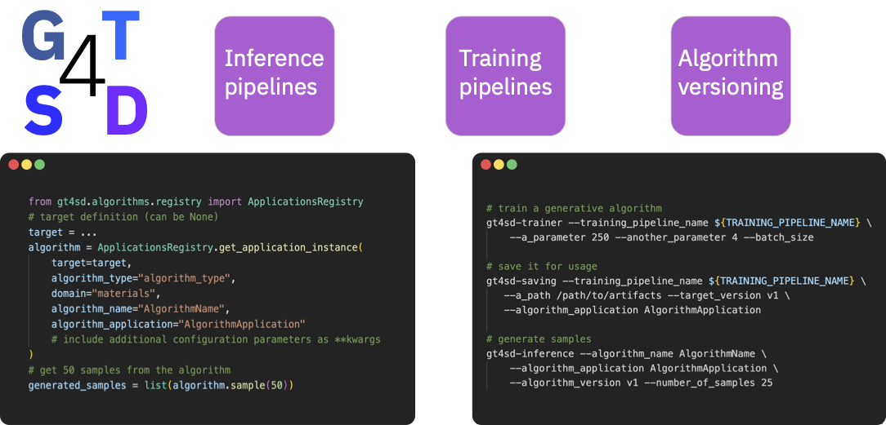
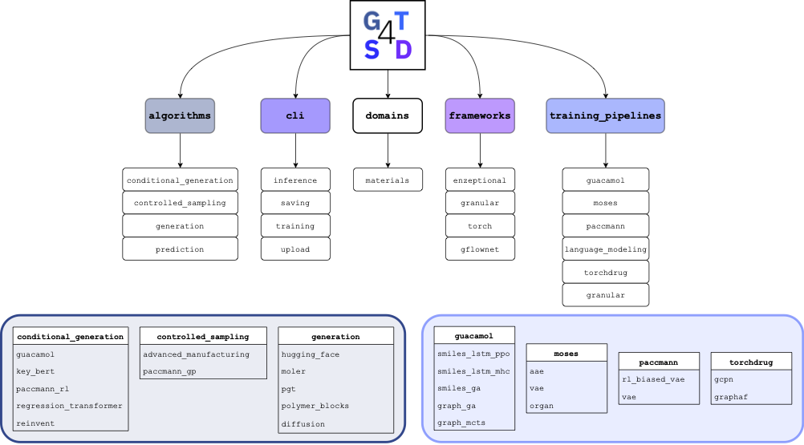

# Generative Toolkit for Scientific Discovery



## Site contents


```{toctree}
---
maxdepth: 2
---
Examples on how to use the GT4SD algorithms <source/gt4sd_inference_usage_md.md>
Examples on how to add an algorithm to GT4SD <source/gt4sd_algorithm_addition_md.md>
Examples on how to upload models on a self-hosted minio service using GT4SD <source/gt4sd_server_upload_md.md>
Example on how to use GFlowNet for a generic task using GT4SD <source/gt4sd_gfn_usage_md.md>
```

## Python API

```{toctree}
---
maxdepth: 1

---
API of the gt4sd package <api/gt4sd>
```


