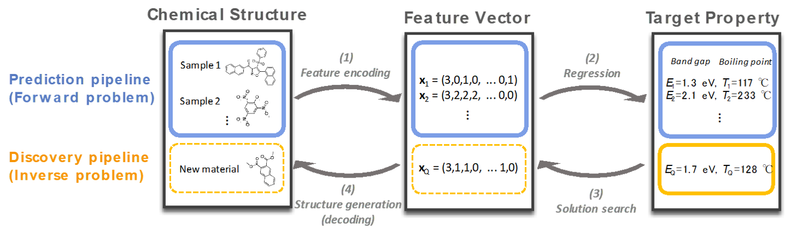
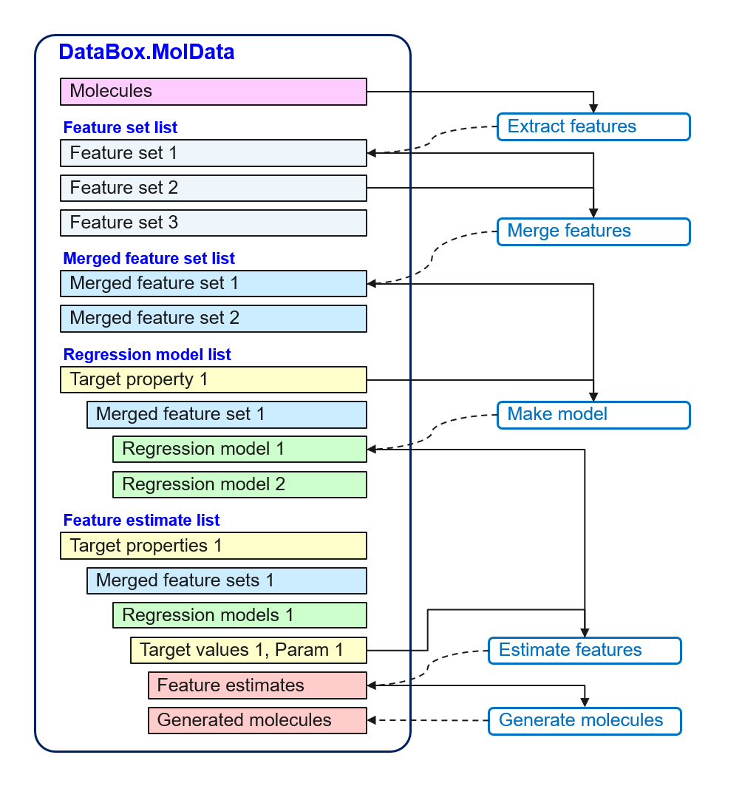

.. _overview:

**********************************************
Overview of IBM Molecule Generation Experience
**********************************************

IBM Molecule Generation Experience (MolGX) is a toolkit which aims to 
find new materials satisfying required chemical properties.
This documentation is for a community version which implements
a small yet essential subset of its capabilities selected from
its enterprise version. 

.. _material_discovery_process:

Material discovery using MolGX
==============================

MolGX is written in `Python
<https://www.python.org/>`_ and supports the
following steps in material discovery. 

- Forward problem
  
  1. **Feature encoding**

     Features characterizing molecules are extracted from a set of
     molecular structures.
     
  2. **Regression**

     Regression models for target properties are built from extracted
     feature vectors.
     
- Inverse problem
  
  3. **Solution search**

     Using regression models, feature vectors satisfying specified property values
     are estimated. 
     
  4. **Structure generation**

     New molecular structures satisfying feature vectors are
     generated.

The first step of the material discovery is to find a reasonable 
feature set effectively describing the target property of molecules. While
there are various types of features for predicting a property of molecules,
we mainly consider structural features of the molecules. The structural
features are useful for addressing the inverse problem
on generating molecular structures, which occurs in the later step. 

The second step is to train a regression model which accurately
predicts the target property.
MolGX offers several classes which wrap models from 
the `scikit-learn
<http://scikit-learn.org/stable/index.html>`_ python library. 

The first two steps (called the forward problem) are key to 
a success in the material discovery. 
If we fail to identify effective features or to develop an accurate regression model,
it is difficult to successfully solve the inverse problem which refers to
the steps of searching for new molecular structures. 
You should, therefore, take great care
of addressing the forward problem by comparing the
results of various features and regression models.

Once you obtain a reasonable regression model, it is time to address the inverse problem
whose steps are in an opposite manner to solving the forward problem. 

The third step is to find feature vectors yielding predictive values
which meets conditions on the target property with the regression models.
In practice, since a regression model returns an identical value
for different feature vectors, there are typically many feature
vectors which meet a requirement to the predictive value. 

The final step is to generate molecular structures
corresponding to the obtained feature vectors. At present, the molecule
generator in MolGX attempts to exhaustively generate all the molecular
structures. Therefore, many unrealistic/similar molecules
might be generated, which is particularly the case
in the Community Version.  
We are working on an approach for generating a more diverse set of molecular
structures. 

.. _tool_framework:

MolGX framework
==================

.. py:currentmodule:: molgx
	   
The steps required for material discovery are typically complex. 
For example, it is unknown in advance which
features effectively describe the target property of molecules. 
Trial and error is therefore indispensable to discover the right features
as well as the right regression model. 
MolGX is designed for supporting such an attempt
by realizing flexible selection of the features and
application of the regression models.

You can start with creating a :py:class:`DataBox.MolData` object from molecule data.
This object consists of molecular structure data (SMILES or SMARTS) and
properties. Thereafter, you can perform all the steps only with
the object. All the intermediate results are stored in the
object associating with related data. You can restore them for
proceeding to the subsequent steps.

.. py:currentmodule:: molgx.DataBox

Extracting features
-------------------

MolGX provides feature extractors for dealing with various types of
features such as the number of heavy atoms, the number of (aromatic) rings,
and the number of sub-structures. Feature sets extracted by
:py:meth:`MolData.extract_features()` are automatically stored in the
:py:class:`MolData` object associated with *an id of the feature
extractor*. You can restore the feature set at any time afterwards
with :py:meth:`MolData.get_features()`.

You can check the stored feature sets with
:py:meth:`MolData.print_features()`.

Merging features
----------------

Finding a feature vector effectively describing a molecule property is a
difficult task. MolGX attempts to facilitate this task by providing a
way to combine features. 
:py:meth:`MolData.merge_features()` allows you to merge any chosen
combination of the stored feature sets into a new, longer feature vector
represented as a merged feature set. 
The merged feature set is also
stored in the :py:class:`MolData` object associated with *an id of the
feature set*. You can restore it with
:py:meth:`MolData.get_merged_features()` as well as 
display its information by calling
:py:meth:`MolData.print_merged_features()`.

Creating model
--------------

MolGX provides several regression models to perform a prediction
with a stored feature set. You can fit a regression model
for a specified target property to feature vectors of the molecule
data. You can either manually set hyperparameters of the regression model with
:py:meth:`MolData.fit_regression_model`, or automatically optimize them 
with
:py:meth:`MolData.optimize_regression_model()`.

An obtained regression
model is stored in the :py:class:`MolData` object associated with *a
target property and a merged feature set*.
:py:meth:`MolData.get_regression_model()` allows you to restore the model whenever necessary.
Therefore, you
can create several regression models based on different combinations of the feature
sets and different machine learning models, and can compare their accuracy to choose the
most effective one. 

Some features in a feature set may not contribute to improving the
prediction of a target property. You can eliminate such features
and select only important ones using
:py:meth:`MolData.select_features()`.

You can check a list of stored regression models by calling
:py:meth:`MolData.print_regression_models()`.
The accuracy of each model with a cross validation is also shown.

Estimating features
-------------------

In solving the inverse problem, :py:meth:`MolData.estimate_feature()`
is a method to find a feature vector which
satisfies conditions on prediction values with regression models. 
In practice, there should be many
feature vectors which meet specified conditions. A container of
the feature vectors found by the method is created associated
with *regression models*. All of these vectors are stored in the container object
associated with *a design parameter* which is a collection of target
values and parameters for the inverse design. You can restore the
container object using :py:meth:`MolData.get_feature_estimate()`, and
can get feature vectors there. 

You can check the estimated feature vectors by calling
:py:meth:`MolData.print_feature_estimates()`. The number of feature vectors
discovered is also shown under the corresponding target value.
 
Generating molecules
--------------------

:py:meth:`MolData.generate_molecule()` can generate molecular structures,
given estimated feature vectors as input.
This method can perform molecular generation even without the estimated feature vectors. 

All the generated
molecules (represented as SMILES strings) are stored in the same container object 
for feature estimation. 
This container object is associated with *regression models* in :py:class:`MolData`.
You can get the generated molecules there. 

You can check the generated molecular structures by calling
:py:meth:`MolData.print_feature_estimates()`.
