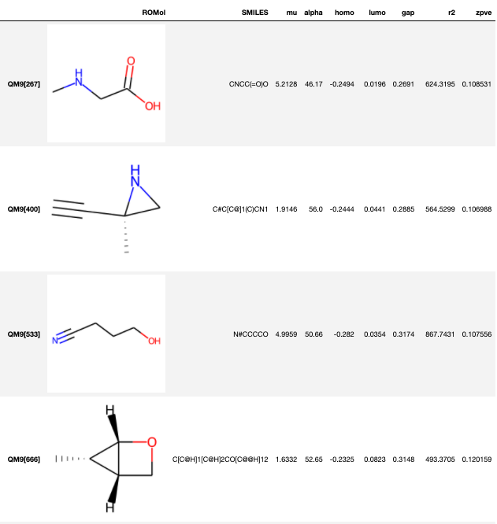
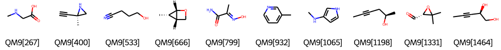
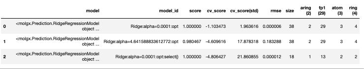
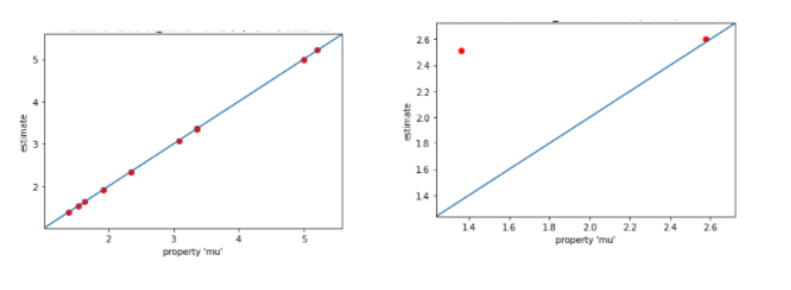
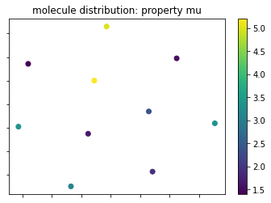
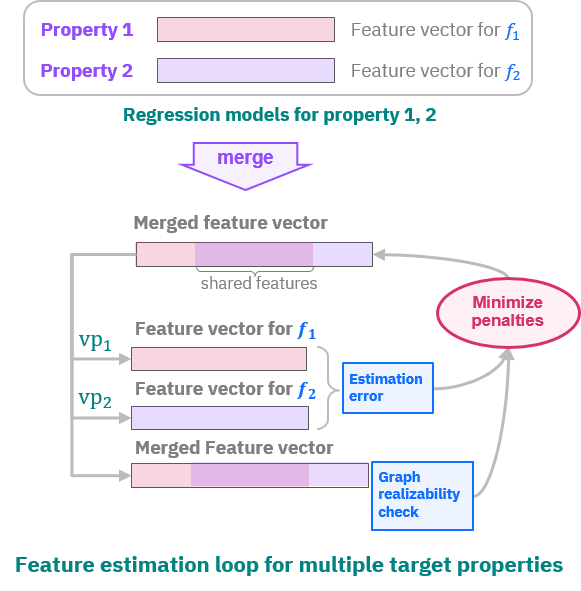
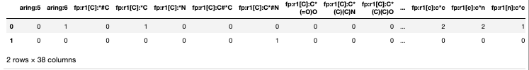
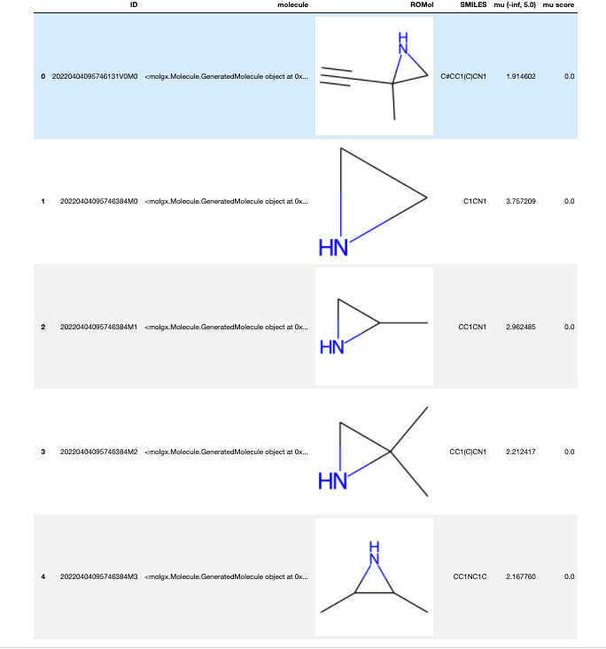

.. _tutorial:

********
Tutorial
********

.. py:currentmodule:: molgx.DataBox
		      
This section describes many of the basic functions in the IBM Molecule
Generation Experience (MolGX) 
to experience necessary steps in material discovery through its high-level
interface of the :py:class:`MolData` object.
Using `MolData`, you can work on material discovery 
even without getting to know the details of customizing MolGX for your needs. 

Compared to the tutorial in the Jupyter notebook :file:`MolGX_Tutorial.ipynb`,
this section provides more details of the usage of the Python objects,
based on the same workflow in the Jupyter notebook. 

Let's go through the material discovery process using `MolData`.

|

.. _create_moldata:

Creating MolData
================

.. _moldata_from_csv:

Creating MolData from csv file
------------------------------

The easiest way to create an :py:class:`MolData` object is to create
it from a csv file.
The csv file should have an id of a molecule in the first column
as well as a column with the name of either SMILES or SMARTS.
Th ``SMILES``or ``SMART`` column intends to list the structural information
of the molecules in either SMILES or SMARTS format.  
The other columns are automatically regarded as properties of
molecules named by their headers. 

You can read a sample csv file below using
:py:meth:`MolData.read_csv()`.

.. code-block:: python
		
    >>> from molgx import *
    >>> moldata = MolData.read_csv('QM9_sample.csv')

.. csv-table:: sample.csv file for MolData
    :file: _static/QM9_sample.csv
    :header-rows: 1

The ``SMILES`` column is reserved for the structural information of a
molecule. All the other columns of ``mu``, ``alpha``, ``home``,
``lumo``, ``gap``, ``r2``, and ``zpve`` are regarded as numerical
properties of a molecule.

.. note:: 

    Currently only numerical properties are supported. Categorical
    values should be supported in the future with an enhancement of
    prediction models.

``SMILES`` and ``SMARTS`` are predefined column names for the structural
information.  If your csv file has a different column name, 
you can specify the name with options ``smiles_col`` or ``smarts_col``. 

.. code-block:: python

    >>> # change column name for SMILES		
    >>> moldata = MolData.read_csv('QM9_sample.csv', smiles_col='smiles')

.. _moldata_from_sdf_file:

Creating MolData from sdf file
------------------------------

You can also create a :py:class:`MolData` object from a SDF format file.
A simple sequence number is assigned as an id of a molecule in
``MolData``. If a name of a molecule is given at the first line of a mol
block, it is stored as a property of 'ID'. Other properties defined
following the mol block section are stored as
properties of molecules in ``MolData``.

.. code-block:: python

    >>> moldata = MolData.read_sdf('sample.sdf')
   

.. _moldata_from_data:

Creating MolData from Molecules and PropertySet
-----------------------------------------------

.. py:currentmodule:: molgx.DataBox

A :py:class:`MolData` object is created directly from a list
of :py:class:`molgx.Molecule.SimpleMolecule` and a
:py:class:`molgx.Molecule.PropertySet`. You can see an example
in the MolData creation using
:py:meth:`molgx.Utility.fetch_QM9()`.

.. code-block:: python

    >>> from molgx import *
    >>> mols, property_set = fetch_QM9('/srv/share/data/QM-9', num_data=1000)
    >>> moldata = MolData(mols, property_set)

``mols`` is a list of SimpleMolecule objects, and ``property_set`` is a
PropertySet object. Both of them are python objects provided by MolGX. 
For molecule data provided in a special format file such as
QM_9, you can write you own script to create a MolData.

.. note:: 

   To successfully run the example above,
   you need to download appropriate data from the `QM9 database website
   <http://quantum-machine.org/datasets/>`_ and
   specify ``file_type`` unless it is in mol format. 

As a reference, let's look into a simplified implementation of
the fetch_QM9() method.

.. code-block:: python
    :emphasize-lines: 19, 31, 35

    # -*- coding:utf-8 -*-
    from rdkit import Chem
    from molgx.Molecule import SimpleMolecule, Property, PropertySet
    import os

    def fetch_QM9(directory, num_data=1000):
        # make a property position map
        prop_map = {
            Property('mu'):     0,   Property('alpha'):  1,
            Property('homo'):   2,   Property('lumo'):   3,
            Property('gap'):    4,   Property('r2'):     5,
            Property('zpve'):   6,   Property('U0'):     7,
            Property('U'):      8,   Property('H'):      9,
            Property('G'):     10,   Property('Cv'):    11,
        }

        # get molecule data
        molecules = []
        properties = PropertySet(prop_map.keys())
        # determine how to extract data from QM9 files
        for i in range(1, num_data+1):
            id = 'QM9[{0}]'.format(i)
            filename = 'dsgdb9nsd_{0:06d}.mol'.format(i)
            filepath = os.path.join(directory, filename)
            if os.path.exists(filepath):
                mol = Chem.MolFromMolFile(filepath)
		if mol is None:
		    continue
                mol = Chem.MolFromSmiles(Chem.MolToSmiles(mol))
                with open(filepath, 'r') as file:
                    moldata = file.readline()
                if not mol is None:
                    molecule = SimpleMolecule(id, mol=mol)
                    smiles = Chem.MolToSmiles(mol)
                    propdata = list(map(float, moldata.split('\t')[4:]))
                    for prop, pos in prop_map.items():
                        molecule.set_property(prop, propdata[pos])
                    molecules.append(molecule)
        return molecules, properties

.. py:currentmodule:: molgx.Molecule

:py:class:`Property` is created from a string of a property name, and
:py:class:`PropertySet` is created from a list of Property. You can
also add a new Property to a PropertySet after it is created (see the
first highlighted line in the code above).

:py:class:`SimpleMolecule` is a wrapper class of the Mol object of
RDKit. It is created from either an id string and a Mol object of RDKit.
You can also create it from a SMILES string or a SMARTS string, using
options ``smiles=`` or ``smarts=`` in place of ``mol=``. In such
cases, a Mol object is created internally in the constructor of Molecule
(see the second highlighted line in the code).

After a Molecule object is created, it is necessary to set values of
properties to a molecule, using the :py:meth:`Molecule.set_property()`
method. These values are stored in their corresponding Molecule object,
and restored for generating a data for the property prediction
(see the last highlighted line in the code above).

.. _moldata_dataframe:

DataFrame from MolData
----------------------

.. py:currentmodule:: molgx.DataBox

:py:meth:`MolData.get_dataframe()` returns a table of molecules and
properties stored in MolData as 
`DataFrame
<https://pandas.pydata.org/pandas-docs/stable/generated/pandas.DataFrame.html#pandas.DataFrame>`_
of the `pandas <https://pandas.pydata.org/pandas-docs/stable/index.html>`_
library. You can control the columns to include in the table by Boolean options
``smiles=``, ``smarts=``, and ``property=``. 

.. code-block:: python

    >>> moldata.get_dataframe(smiles=True, property=True)
                                SMILES    ...          zpve
    QM9[267]                 CNCC(=O)O    ...      0.108531
    QM9[400]            C#C[C@]1(C)CN1    ...      0.106988
    QM9[533]                   N#CCCCO    ...      0.107556
    QM9[666]   C[C@H]1[C@H]2CO[C@@H]12    ...      0.120159
    QM9[799]           C/C(=N\O)C(N)=O    ...      0.100061
    QM9[932]                 Cc1cccnc1    ...      0.115957
                                   ...    ...           ...

With the `IPython <https://ipython.org/>`_ environment such as
`Jypyter notebook <https://jupyter.org/>`_, you can include 2D images
of molecules in the dataframe by specifying Boolean option ``mols=``,
thus being able to verify the molecular structure of molecules in ``MolData``.

.. code-block:: python

    >>> moldata.get_dataframe(mols=True, smiles=True, property=True)

The dataframe is also used to save the data in a CSV file. You
can do so :py:meth:`MolData.write_csv()` which has 
the same options (default
values are different) to select the data to include. 

.. code-block:: python

    >>> moldata.write_csv('sample.csv', smiles=True, property=True)

		
.. _molecule_in_moldata:

Molecules in MolData
--------------------

A :py:class:`molgx.Molecule.SimpleMolecule` object in a
:py:class:`MolData` object is obtained by :py:meth:`MolData.get_mol()`
with an id of a molecule, or by :py:meth:`MolData.get_mol_by_index()`
with an index of a molecule in a list.
:py:meth:`molgx.Molecule.SimpleMolecule.get_mol()` returns 
a Mol object of RDKit stored in a Molecule object. 

.. code-block:: python

    >>> # get Molecule from an id
    >>> molecule1 = moldata.get_mol('QM9[267]')
    >>> # get Molecule from an index
    >>> molecule2 = moldata.get_mol_by_index(0)
    >>> # get Mol of rdkit
    >>> mol1 = molecule1.get_mol()

:py:meth:`MolData.print_mol_info()` or :py:meth:`MolData.print_mol_info_by_index()`
displays the contents of a Molecule object, including its id, SMILES and SMARTS
representations, and properties stored there. 

.. code-block:: python
    
    >>> moldata.print_mol_info('QM9[267]')
    Molecule: id=QM9[267] SMILES=CNCC(=O)O SMARTS=[#6]-[#7]-[#6]-[#6](=[#8])-[#8]
    Properties:
      {'mu': 5.2128, 'alpha': 46.17, 'homo': -0.2494, 'lumo': 0.0196, 'gap': 0.2691, 'r2': 624.3195, 'zpve': 0.108531}

Just after the creation of MolData, a Molecule object has only property values.
When feature extraction is performed, individual feature values of
a molecule are additionally stored in the Molecule object.
You can check the contents with the above same methods. 

:py:meth:`MolData.draw_molecules()` draws 
molecular structures of molecules in MolData. 
This method internally calls the
`Chem.Draw.MolsToGridImage()
<http://www.rdkit.org/Python_Docs/rdkit.Chem.Draw-module.html#_MolsToGridImage>`_
method of RDKit, and can save the
created image as a png file. You can specify the number of molecules to 
print in a line by option ``mols_per_line=``, and the size of each
molecule by option ``sub_image_size=``.

.. code-block:: python

    >>> molecules = moldata.get_mols()		
    >>> img = moldata.draw_molecules(molecules)
    <PIL.Image.Image image mode=RGBA size=1000x200 at 0x176A2FCD5F8>
    >>> img.save('molecules.png')

.. _masking_moldata:

Masking molecules in MolData
----------------------------

To exclude some molecules from the model development, you
can mask them by setting a data mask with
:py:meth:`MolData.set_mols_mask()`. The method receives a
list of Boolean values (True/False) as an argument.
The molecules whose elements at their corresponding indices in the list are set to True are
effective for the model development.

You can easily control a mask using a `dataframe indexing function
<https://pandas.pydata.org/pandas-docs/stable/user_guide/indexing.html#boolean-indexing>`_
for filtering by column values. For example, to filter out
molecules by means of property values, you can generate a mask (a list of
Boolean values) by an expression like ``df['mu'] > 2.0``. This gives
a Boolean list with True only for indices of column ``'mu'`` greater
than 2.0.

.. code-block:: python

    >>> # get a dataframe of molecules and their property values
    >>> df = moldata.get_dataframe(property=True)
    >>> # set a mask of molecules whose 'mu' property value is larger than 2.0
    >>> moldata.set_mols_mask(df['mu'] > 2.0)
    >>> # check the effective moldata by making dataframe with 'with_mask=' True
    >>> moldata.get_dataframe(property=True, with_mask=True)

Similar masks associated with a feature extraction are automatically
created when a feature is extracted. 
Molecule whose features are not successfully extracted by a feature extractor
are excluded from the training set for the model development.
These masks are internally
created and are used in extracting learning data for the model
development. 

.. _saveload__moldata:

Saving/Loading MolData
----------------------

A :py:class:`MolData` object can be saved in pickle format by
the :py:meth:`MolData.save()` method, and restored by
the :py:meth:`MolData.load()` method.

.. code-block:: python

    >>> # save moldata object
    >>> moldata.save('moldata.pickle')
    >>> # load moldata object
    >>> moldata = MolData.load('moldata.pickle')

Since all the intermediate results of encoding, prediction, feature
estimation, and molecule generation are stored in the
:py:class:`MolData`, you can hold the material discovery process and
restart it at any time.

|	   

.. _encode_feature:

Feature Encoding
================

.. py:currentmodule:: molgx
		      

Encoding the features of a molecule is a necessary step to analyze the
characteristics and the relation to a property of that molecule. MolGX
provides several classes for extracting the features in different
ways and for constructing a feature vector. They are defined as a subclass of
:py:class:`FeatureExtraction.FeatureExtractor`. 

.. py:currentmodule:: molgx.FeatureExtraction

* :py:class:`StructureCounting`

  Base class for counting the number of a certain sub-structure of a
  molecule as a feature. All the features extracted in this category
  is used a basis for molecule generation in addressing the inverse
  problem.

  - :py:class:`HeavyAtomExtractor`

    Count the number of different heavy atoms. The charge of ionized
    atom and the maximum number of valences of the same atom are
    extracted. 

  - :py:class:`RingExtractor`

    Count the number of rings of different sizes by the SSSR
    (smallest sets of smallest rings) algorithm.

  - :py:class:`AromaticRingExtractor`

    Count the number of aromatic rings of different sizes.

  - :py:class:`StructureExtractor`

    Base class for structure extraction.
      
    - :py:class:`FingerPrintStructureExtractor`

      Count the number of fingerprint structure in a molecular
      structure.

* :py:class:`FeatureOperator`

  Base class for calculating a feature from existing features.

  - :py:class:`FeatureSumOperator`

    Calculate a sum of feature values.

.. py:currentmodule:: molgx.DataBox

:py:func:`print_feature_extractor()` displays a list of 
available feature extractors. 
   
.. code-block:: python

    >>> print_feature_extractor()
    Available feature extractors:
    0: HeavyAtomExtractor
    1: RingExtractor
    2: AromaticRingExtractor
    3: FingerPrintStructureExtractor
    4: FeatureSumOperator

.. _feature_feature_set:

Feature and FeatureSet
----------------------

.. py:currentmodule:: molgx.FeatureExtraction

MolGX represents extracted features as :py:class:`Feature` and
:py:class:`FeatureSet`. We explain how to use them
for describing the features.

We use :py:class:`HeavyAtomExtractor` as an example. 
You can extract the number of different heavy atoms to express them
as features of a molecule. 

.. code-block:: python

    >>> # extract heavy atom features
    >>> extractor = HeavyAtomExtractor(moldata)
    >>> fs_atom = moldata.extract_features(extractor)
    heavy_atom: extracted 4 unique features []
    >>> fs_atom.get_id()
    'heavy_atom'
    >>> # print features in a feature set
    >>> fs_atom.print_features()
    heavy_atom:['atom:C', 'atom:N', 'atom:O']

.. py:currentmodule:: molgx.DataBox

:py:class:`MolData.extract_features()` returns a FeatureSet object
``fs_atom`` as a result, which consists of individual Feature objects
extracted from all the molecules in ``moldata``. In this case, 3
different atoms as features are found in the molecules. A FeatureSet
has an id set by the feature extractor, and an id of ``fs_atom`` is
'heavy_atom'. If a feature extractor takes parameters in the
construction, the parameter values are also added to the id of a
feature set.

.. py:currentmodule:: molgx.FeatureExtraction

You can check the contents of the FeatureSet ``fs_atom`` using
:py:class:`FeatureSet.print_features()`. ``atom:C``, ``atom:N``,
and ``atom:O`` are the id of individual Feature objects.

Actual feature values are stored in a Molecule object as in case of
properties. Let's check the contents of a molecule.

.. code-block:: python

    >>> moldata.print_mol_info('QM9[267]')
    Molecule: id=QM9[267] SMILES=CNCC(=O)O SMARTS=[#6]-[#7]-[#6]-[#6](=[#8])-[#8]
    Properties:
      {'mu': 5.2128, 'alpha': 46.17, 'homo': -0.2494, 'lumo': 0.0196, 'gap': 0.2691, 'r2': 624.3195, 'zpve': 0.108531}
    FeatureSet:heavy_atom
      {'atom:C': 3, 'atom:N': 1, 'atom:O': 2}

As you can see, a molecule of ``QM9[267]`` has 3 carbon atoms, 1
nitrogen atom, and 2 oxygen atoms as feature values of a feature set
``heavy_atom``.

.. _feature_set_in_moldata:

Feature set in MolData
----------------------

.. py:currentmodule:: molgx.DataBox

If you extract features using high-level interface
:py:class:`MolData.extract_features()`, the extracted feature set is
automatically stored in MolData. You can check the extracted feature
sets using :py:class:`MolData.print_features()`.

.. code-block:: python

    >>> moldata.print_features()
    feature set list
      0:heavy_atom

The extracted feature set ``heavy_atom`` is shown with an index ``0`` in
``moldata``. You can retrieve the feature set from ``moldata`` using
its id or index. 

.. code-block:: python

    >>> fs = moldata.get_features('heavy_atom')
    >>> fs
    <molgx.FeatureExtraction.FeatureSet at 0x176a3087978>
    >>> fs = moldata.get_features_by_index(0)
    >>> fs
    <molgx.FeatureExtraction.FeatureSet at 0x176a3087978>

.. _feature_vector_dataframe:

Feature vector as DataFrame
---------------------------

.. py:currentmodule:: molgx.DataBox
		      
:py:meth:`MolData.get_dataframe()` returns the features stored in MolData as a 
`DataFrame
<https://pandas.pydata.org/pandas-docs/stable/generated/pandas.DataFrame.html#pandas.DataFrame>`_
of the `pandas <https://pandas.pydata.org/pandas-docs/stable/index.html>`_
python library in the same way as the properties from MolData.

.. code-block:: python

    >>> df = moldata.get_dataframe(features=fs_atom)
    >>> df
                     atom:C  atom:F  atom:N  atom:O
    QM9[1]          1.0     0.0     0.0     0.0
    QM9[134]        4.0     0.0     0.0     1.0
    QM9[267]        3.0     0.0     1.0     2.0
    QM9[400]        5.0     0.0     1.0     0.0
    QM9[533]        4.0     0.0     1.0     1.0
    QM9[666]        5.0     0.0     0.0     1.0
                 ...     ...     ...     ...

                    atom:C  atom:N  atom:O
    QM9[267]        3        1        2
    QM9[400]        5        1        0
    QM9[533]        4        1        1
    QM9[666]        5        0        1
    QM9[799]        3        2        2
                 ...     ...     ...     ...
		 
.. py:currentmodule:: molgx.FeatureExtraction

Columns are sorted in the same order of
the features obtained from a feature set using
:py:meth:`FeatureSet.get_feature_list()`. It is useful when you want
to apply any special processing only to specific features.

.. py:currentmodule:: molgx.DataBox

You can also save the same table using
:py:meth:`MolData.write_csv()`. You can choose the properties of
the molecules as well as their features to save in a csv file.
		 
.. code-block:: python

    >>> moldata.write_csv('sample.csv', smiles=True, property=True, features=fs_atom)

It is useful to save the feature vector with the properties in the
file, for example, when you want to apply the obtained feature vector
to your own tools. 

.. _merge_features:

Merging FeatureSets
-------------------

.. py:currentmodule:: molgx.DataBox

Individual feature extractors extract only specific types of features
from molecules. We need a more expressive set of features for effective
regression analysis performed in the next step.
MolGX provides a way to merge FeatureSet stored
in a MolData, thus obtaining a richer feature vector with more features
for a molecule.

.. code-block:: python

    >>> fs_ring = moldata.extract_features(RingExtractor(moldata))
    >>> fs_aring = moldata.extract_features(AromaticRingExtractor(moldata))
    >>> fs_sub1 = moldata.extract_features(FingerPrintStructureExtractor(moldata, radius=1))
    >>> moldata.print_features()
    feature set list:
      0: heavy_atom
      1: ring
      2: aromatic_ring
      3: finger_print_structure:radius=1    

Now you have 4 FeatureSet: ``heavy_atom``, ``ring``, ``aromatic_ring``, and
``finger_print_structure:radius=1`` stored
in ``moldata``. You can merge these FeatureSet into a new FeatureSet
using :py:class:`MolData.merge_features()` or :py:class:`MolData.merge_features_by_index()`.

.. code-block:: python

    >>> fs_all = moldata.merge_features([fs_atom.id, fs_ring.id, fs_aring.id, fs_sub1.id])
    >>> fs_base = moldata.merge_features_by_index([0,1,2])
    >>> moldata.print_merged_features()
    merged feature set list:
      0: |aromatic_ring|finger_print_structure:radius=1|heavy_atom|ring|
      1: |aromatic_ring|heavy_atom|ring|

Two merged FeatureSet:
``|aromatic_ring|finger_print_structure:radius=1|heavy_atom|ring|``
and ``|aromatic_ring|heavy_atom|ring|`` are saved in ``moldata``.  The
id of each merged feature set is constructed as a concatenated string of
the ids of the original feature sets.
You can retrieve the merged feature set from ``moldata``
using the id of the merged feature set, or the index of the merged
feature set like in case of the feature set.

.. code-block:: python

    >>> fs_base = moldata.get_merged_features('|aromatic_ring|heavy_atom|ring|')
    >>> fs_base
    <molgx.FeatureExtraction.MergedFeatureSet at 0x176a31f3da0>
    >>> fs_base = moldata.get_merged_features_by_index(1)
    >>> fs_base
    <molgx.FeatureExtraction.MergedFeatureSet at 0x176a31f3da0>

A merged feature set can be used for an optional parameter
``features=`` of :py:meth:`MolData.get_dataframe()` and
:py:meth:`MolData.write_csv()` as well as a feature set.

.. code-block:: python

    >>> df = moldata.get_dataframe(features=fs_base)
    >>> moldata.write_csv("sample.csv", smiles=True, property=True, features=fs_base)

    
.. _feature_operator:

Feature calculated from existing features
-----------------------------------------

.. py:currentmodule:: molgx.FeatureExtraction

You can calculate a new feature from existing features by using
sub-classes of :py:class:`FeatureOperator`. While feature extractors
calculate a new feature from structural data of a molecule, feature
operator calculate a new feature from extracted features. The constructor
of :py:class:`FeatureOperator` takes :py:class:`FeatureSet` as
an argument as well as a MolData object.
The extractor of the feature operator calculates a new feature from feature
values of a feature set stored in a molecule.

In the community version of MolGX, we support only :py:class:`FeatureSumOperator`,
which calculates a sum of feature values in a feature set. 
For example, after you apply :py:class:`HeavyAtomExtractor` to a
molecule and get the number of atoms for each atom symbol, you can
get the total number of atoms by applying
:py:class:`FeatureSumOperator`.
    
.. code-block:: python
    :emphasize-lines: 5,9,16

    >>> # get the number of heavy atoms
    >>> fs_atom = moldata.extract_features(HeavyAtomExtractor(moldata))
    >>> # get the total number of heavy atoms
    >>> fs_atom_sum =  moldata.extract_features(FeatureSumOperator(moldata, fs_atom))
    >>> moldata.print_features()
    feature set list:
      0:heavy_atom
      1:heavy_atom:sum()
    >>> moldata.print_mol_info('QM9[267]')
    Molecule: id=QM9[267] SMILES=CNCC(=O)O SMARTS=[#6]-[#7]-[#6]-[#6](=[#8])-[#8]
    Properties:
      {'mu': 5.2128, 'alpha': 46.17, 'homo': -0.2494, 'lumo': 0.0196, 'gap': 0.2691, 'r2': 624.3195, 'zpve': 0.108531}
    FeatureSet:heavy_atom
      {'atom:C': 3, 'atom:N': 1, 'atom:O': 2}
    FeatureSet:heavy_atom:sum()
      {'atom:sum': 6}

|    

.. _predict_property: 

Property Prediction
===================

A property of a molecule is analyzed by a regression model provided
by MolGX.

.. py:currentmodule:: molgx.Prediction

* :py:class:`RegressionModel`

  Base class of a regression model.

  - :py:class:`SklearnRegressionModel`

    Base class of a regression model wrapping estimators implemented
    in the `scikit-learn <http://scikit-learn.org/stable/index.html>`_
    python library.

    + :py:class:`SklearnLinearRegressionModel`

      Base class of a linear regression model wrapping estimators implemented
      in the `scikit-learn <http://scikit-learn.org/stable/index.html>`_
      python library.

      + :py:class:`LinearRegressionModel`

        A general linear regression model
        (`sklearn.linear_model.LenearRegression <http://scikit-learn.org/stable/modules/generated/sklearn.linear_model.LinearRegression.html#sklearn.linear_model.LinearRegression>`_)

      + :py:class:`RidgeRegressionModel`

        A linear regression model with L2 regularization
        (`sklearn.linear_model.Ridge <http://scikit-learn.org/stable/modules/generated/sklearn.linear_model.Ridge.html#sklearn.linear_model.Ridge>`_)

      + :py:class:`LassoRegressionModel`

        A linear regression model with L1 regularization
        (`sklearn.linear_model.Lasso <http://scikit-learn.org/stable/modules/generated/sklearn.linear_model.Lasso.html#sklearn.linear_model.Lasso>`_)

      + :py:class:`ElasticNetRegressionModel`

        A linear regression model with L1 and L2 regularization
        (`sklearn.linear_model.ElasticNet <http://scikit-learn.org/stable/modules/generated/sklearn.linear_model.Lasso.html#sklearn.linear_model.ElasticNet>`_)

    + :py:class:`RandomForestRegressionModel`

      A non-linear regression model of random forest regression
      (`sklearn.ensemble.RandomForestRegressor <https://scikit-learn.org/stable/modules/generated/sklearn.ensemble.RandomForestRegressor.html#sklearn.ensemble.RandomForestRegressor>`_)

.. py:currentmodule:: molgx.DataBox

:py:func:`print_regression_model()` displays a list of
available regression models. 
   
.. code-block:: python

    >>> print_regression_model()
    Available regression models:
    0: LinearRegressionModel
    1: RidgeRegressionModel
    2: LassoRegressionModel
    3: ElasticNetRegressionModel
    4: RandomForestRegressionModel

.. _model_fitting:
   
Model fitting
-------------

.. py:currentmodule:: molgx.DataBox

You need to fit a regression model to data for predicting a property
value. MolGX provides four different fitting methods in
:py:class:`MolData`.

* :py:meth:`MolData.fit_regression_model()`

  A regression model is fitted to a feature vector with manually given
  hyperparameters. The regression model is stored in MolData.

* :py:meth:`MolData.optimize_regression_model()`

  Hyperparameters of a regression model are optimized for a feature
  vector. The regression model is stored in MolData.

* :py:meth:`MolData.select_features()`

  A regression model is fitted to a feature vector of selected
  important features with fixed hyperparameters. The regression model
  and selected features are stored in MolData.

* :py:meth:`MolData.optimize_and_select_features()`

  Hyperparameters of a regression model is optimized for a feature
  vector, and it is again fitted to a feature vector of selected
  important features. The regression model and selected features are
  stored in MolData.

.. py:currentmodule:: molgx.Prediction

The first step is to create a :py:class:`RegressionModel` object with
a specification to a target property, a feature set, and hyperparameters.
You can then fit the model using the above fitting methods.

.. code-block:: python

    >>> model = RidgeRegressionModel(moldata, 'mu', fs_all, alpha=0.1)		
    >>> model = moldata.fit_regression_model(model)
    regression model cross validation target='mu': data_size=10: model:Ridge n_splits=3 shuffle=True

A fitted model is identified by a target property, a type of a regression model,
hyperparameter values, and a status. Therefore, its id may
change depending on the fitting result.

    
.. code-block:: python    

    >>> model.get_id()
    'Ridge:alpha=0.1:fit'

To automatically optimize hyperparameters by the
fitting methods, you do not have to specify the hyperparameters in creating the
model.

.. code-block:: python

    >>> model = RidgeRegressionModel(moldata, 'mu', fs_all)		
    >>> model = moldata.optimize_regression_model(model)
    regression model parameter optimization target='mu': data_size=10: model:Ridge n_splits=3 shuffle=True
    optimized parameters: {'alpha': 0.0001}
    regression model cross validation target='mu': data_size=10: model:Ridge n_splits=3 shuffle=True
    R^2 score=1.00 cv_score=-1.10 (+/- 1.96)
    >>> model.get_id()
    'Ridge:alpha=0.0001:opt'

.. py:currentmodule:: molgx.DataBox

Since the best hyperparameters are automatically set to the model,
the optimized model is additionally saved in
MolData with the id that is automatically updated.
You can check a list of regression models stored in MolData
using :py:class:`MolData.print_regression_models()`.

.. code-block:: python
    :emphasize-lines: 3, 4

    >>> moldata.print_regression_models()
    regression model list:''
     * target property: 'mu'
      + features: |aromatic_ring|finger_print_structure:radius=1|heavy_atom|ring|
       0: R^2 score=1.00 cv_score=-1.10 (+/- 1.96) size=38/38 Ridge:alpha=0.0001:opt
    
Regression models are stored in MolData categorized by a target
property and a feature vector. An accuracy of each model evaluated by 
cross validation is also shown. You can therefore compare the models
on this list.
You can see a regression model ``Ridge:alpha=0.0001:opt`` is
stored in MolData at the ``0-th`` index. It has a target property
of ``mu`` and a feature vector
``|aromatic_ring|finger_print_structure:radius=1|heavy_atom|ring|``.

You can use the same regression model object when using a different
fitting method. The fitted model is copied, before a new model is stored in
MolData. You can therefore recover the status of the previously fitted model
even after you apply another fitting method to the same model. 

.. code-block:: python
    :emphasize-lines: 12, 13

    >>> model = moldata.select_features(model)
    feature selection target='mu': data_size=10: model:Ridge:alpha=0.0001:opt threshold=None
    feature size:38 -> 18
    regression model cross validation target='mu': data_size=10: model:Ridge n_splits=3 shuffle=True
    R^2 score=1.00 cv_score=-4.81 (+/- 21.86)
    >>> model.get_id()
    'Ridge:alpha=0.0001:opt:select()'
    >>> moldata.print_regression_models()
    regression model list:''
     * target property: 'mu'
      + features: |aromatic_ring|finger_print_structure:radius=1|heavy_atom|ring|
       0: R^2 score=1.00 cv_score=-1.10 (+/- 1.96) size=38/38 Ridge:alpha=0.0001:opt
       1: R^2 score=1.00 cv_score=-4.81 (+/- 21.86) size=18/38 Ridge:alpha=0.0001:opt:select()

Now you have two regression models stored in MolData with the same
property and the same feature vector: ``Ridge:alpha=0.0001:opt``
model with R^2 score of ``1.00`` and cv_score of ``-1.10`` at ``0-th`` index, and
``Ridge:alpha=0.0001:opt:select()`` model with R^2 score of ``1.00`` and cv score
of ``-4.81`` at ``1-th`` index. You can retrieve a regression model using
:py:class:`MolData.get_regression_model()` with the id of a model, or
using :py:class:`MolData.get_regression_model_by_index()` with the
index of a model in the list.
       
.. code-block:: python

    >>> model = moldata.get_regression_model('mu', fs_all.id, 'Ridge:alpha=0.0001:opt:select()')
    >>> model.get_id()
    'Ridge:alpha=0.0001:opt:select()'
    >>> model = moldata.get_regression_model_by_index('mu', fs_all.id, 0)
    >>> model.get_id()
    'Ridge:alpha=0.0001:opt'

.. _param_optimization:

Hyperparameter optimization
---------------------------

.. py:currentmodule:: molgx.Prediction

Hyperparameters of a regression model are optimized by the method of
`sklearn.model_selection.GridSearchCV
<http://scikit-learn.org/stable/modules/generated/sklearn.model_selection.GridSearchCV.html#sklearn.model_selection.GridSearchCV>`_. The
method tries all the grid points given as a dictionary python object
and returns a model with the best grid point. In MolGX, the
hyperparameters for the optimization are defined as a static variable
``hyper_params``. Their default grid points are predefined as a
static variable ``param_grid`` of each regression model such as
:py:const:`RidgeRegressionModel.hyper_params` and
:py:const:`RidgeRegressionModel.param_grid`.

Let's check the contents of ``hyper_params``, and ``param_grid`` of a
regression model.

.. code-block:: python

    >>> RidgeRegressionModel.hyper_params
    ['alpha']
    >>> RidgeRegressionModel.param_grid
    {'alpha': array([1.e-04, 1.e-03, 1.e-02, 1.e-01, 1.e+00, 1.e+01, 1.e+02, 1.e+03])}    

.. py:currentmodule:: molgx.DataBox

You can change the range and the density of the grid search by an
optional parameter `param_grid=` in
:py:meth:`MolData.optimize_regression_model()`. (See
`sklearn.model_selection.GridSearchCV
<http://scikit-learn.org/stable/modules/generated/sklearn.model_selection.GridSearchCV.html#sklearn.model_selection.GridSearchCV>`_.
to see how to define ``param_grid``)

.. code-block:: python

    >>> model = RidgeRegressionModel(moldata, 'mu', fs_all)
    >>> moldata.optimize_regression_model(model, param_grid={'alpha':np.logspace(-4, 2, 19)})
    regression model parameter optimization target='mu': data_size=10: model:Ridge n_splits=3 shuffle=True
    optimized parameters: {'alpha': 4.641588833612772}
    regression model cross validation target='mu': data_size=10: model:Ridge n_splits=3 shuffle=True
    R^2 score=0.98 cv_score=-4.61 (+/- 17.88)

.. _regression_model_summary:     

Summary of regression models
----------------------------

After fitting a regression model with some feature sets, its result
is stored in a MolData object. You can display a summary
table of the regression models sorted by the cross validation sores
using :py:meth:`MolData.get_regression_model_summary()` at any
time.
		  
.. code-block:: Python
		
    >>> legends = {fs_atom.id: 'atom',
    >>>            fs_ring.id: 'ring',
    >>>            fs_aring.id: 'aring',
    >>>            fs_sub1.id: 'fp1'}
    >>> moldata.get_regression_model_summary('mu', legends=legends)
    

.. _predict_other_molecules:     

Prediction for other molecules
------------------------------

.. py:currentmodule:: molgx.Prediction

Sometimes we want to apply a fitted regression model to other molecules that are not
available in MolData.
If the same feature vector used for fitting the regression model is available, you can use
:py:meth:`RegressionModel.predict_single_val()` and
:py:meth:`RegressionModel.predict_val()` for predicting a target property value.

However, it is sometimes difficult to generate such a feature vector in a consistent way,
especially after feature selection is automatically performed. 
We provide a method for generating 
the same feature vector for any set of molecules that are not available in MolData.

.. py:currentmodule:: molgx.FeatureExtraction

A feature set remembers the list of feature extractors used to generate it. 
The same feature extractor can be applied to any set of molecules
by using :py:meth:`FeatureSet.extract_features()`.

.. code-block:: python

    >>> # creating an artificial example
    >>> mol_test = [SimpleMolecule(0, smiles="COC1CC(=NO)C1"), SimpleMolecule(1, smiles="CCCCC(C)=O")]
    >>> mol_test[0].set_property(Property("mu"), 1.3596)
    >>> mol_test[1].set_property(Property("mu"), 2.5767)
    >>> prop_set = PropertySet([Property("mu")])
    >>> # feature extraction
    >>> fs_atom = moldata.extract_features(HeavyAtomExtractor(moldata))
    >>> # extract the same feature (heavy atom)
    >>> fs_atom.extract_features(mol_test)
    >>> mol_test[0].info(features_list=[fs_atom])
    Molecule: id=0 SMILES=COC1CC(=NO)C1 SMARTS=[#6]-[#8]-[#6]1-[#6]-[#6](=[#7]-[#8])-[#6]-1
    Properties:
      {'mu': 1.3596}
    FeatureSet:heavy_atom
      {'atom:C': 5, 'atom:N': 1, 'atom:O': 2}    

You can use a merged feature set for extracting features as well as a
feature set.

.. code-block:: python

    >>> fs_ring = moldata.extract_features(RingExtractor(moldata))
    >>> fs_aring = moldata.extract_features(AromaticRingExtractor(moldata))
    >>> fs_sub1 = moldata.extract_features(FingerPrintStructureExtractor(moldata, radius=1))
    >>> fs_all = moldata.merge_features([fs_atom.id, fs_ring.id, fs_aring.id, fs_sub1.id])
    >>> # extract all the features in a merged feature set
    >>> fs_all.extract_features(mol_test)
    >>> mol_test[0].info(features_list=[fs_all])
    Molecule: id=0 SMILES=COC1CC(=NO)C1 SMARTS=[#6]-[#8]-[#6]1-[#6]-[#6](=[#7]-[#8])-[#6]-1
    Properties:
      {'mu': 1.3596}
    FeatureSet:|aromatic_ring|finger_print_structure:radius=1|heavy_atom|ring|
      {'fp:r1[C]:C*(C)=N': 1, 'fp:r1[C]:C*(C)O': 1, 'fp:r1[C]:C*C': 2, 'fp:r1[N]:C=*O': 1, 'fp:r1[O]:*N': 1, 'fp:r1[O]:C*C': 1, 'atom:C': 5, 'atom:N': 1, 'atom:O': 2, 'ring:4': 1}
    

.. py:currentmodule:: molgx.DataBox

More conveniently you can extract all the features registered in a
moldata from other molecules using
:py:meth:`MolData.extract_same_features()`.

.. code-block:: python

    >>> # extract all the features in a merged feature set
    >>> moldata.extract_same_features(mol_test)

After extracting features from molecules, you can create a feature
vector exactly of the same size in the same order by using the feature set
registered in the MolData object.

.. code-block:: python

    >>> model = moldata.optimize_and_select_features(RidgeRegressionModel(moldata, 'mu', fs_all))
    >>> estimate = model.predict()
    >>> model.plot_estimate()
    >>> # make a feature vector from the same feature set
    >>> fv_test = fs_all.make_feature_vector(mol_test)
    >>> # apply fitted model to the feature vector
    >>> estimate_test = model.predict(dataframe=fv_test)
    >>> model.plot_estimate(df_data=fv_test, df_target=prop_set.make_property_vector(mol_test))

		

.. _output_estimate:     

Outputting estimates with features
----------------------------------

.. py:currentmodule:: molgx.DataBox

:py:meth:`MolData.write_csv()` and :py:meth:`MolData.get_dataframe()`
have an option `models=` for including estimates by fitted
models together with feature values and property values. 
The header title of an estimate is the id of an regression model.

.. code-block:: python

    >>> model1 = moldata.get_regression_model('mu', fs_all.id, 'Ridge:alpha=0.0001:opt:select()')
    >>> model2 = moldata.get_regression_model('mu', fs_all.id, 'Ridge:alpha=0.1:opt')
    >>> moldata.write_csv("sample.csv", features=fs_all, models=[model1, model2])

.. _feature_distribution:

Plotting feature vector distribution
------------------------------------

.. py:currentmodule:: molgx.DataBox

A feature vector is usually very high dimensional, and it is difficult
to get a rough picture of the distribution of the data in the
feature vector space.  To help understand the distribution, 
:py:meth:`MolData.plot_distribution` plots the
feature vectors with target property values by mapping them into 2d
plane using the `t-SNE algorithm <https://lvdmaaten.github.io/tsne/>`_.

.. code-block:: python

    >>> # plot feature vector, features_fp, with target property 'homo'
    >>> moldata.plot_distribution('mu', fs_all)

Although the plotted image does not always lead to precise evaluation of
the effectiveness of the feature vector, we can get a rough tendency
of the data distribution. 
    
    
|    
    
.. _estimate_feature:

Feature Estimation
==================

In the first step of solving the inverse problem in material discovery, 
we search for a feature vector giving a predicted property
value close to the target property value with a regression model.

.. _single_target_property:

Single target property
----------------------

A regression model is simply a numerical function from an :math:`n`
dimensional feature vector (:math:`R^n`) to a real value of a target
property. In the feature estimation, MolGX searches for a feature vector
:math:`fv` minimizing the square error of the target property value
:math:`v_p` and the estimated property value by a regression model
:math:`f_p()`. The square error is normalized by the variance
:math:`\sigma_p^2` of the prediction by the regression model for
convenience.

.. math::

    \newcommand{\argmin}{\mathop{\rm arg~min}\limits}

    fv = \argmin_{v \in R^n} \frac{|v_p - f_p(v)|^2}{\sigma_p^2}

In addition to minimizing the estimation error, MolGX considers the
feasibility of a feature vector as a basis of the molecular structure
generation. The feature vector includes the number of sub-structures
as constraints for the molecular structure generation.  If
their numbers are not consistent with the number of atoms, rings, and
aromatic rings in the feature vector, it is impossible to generate a
molecular structure satisfying all of them. Therefore, MolGX needs to
check the connected graph realizability of the sub-structures
as a necessity condition on the structure generation.

.. math::

    \newcommand{\argmin}{\mathop{\rm arg~min}\limits}

    fv = \argmin_{v \in R^n} \{ \frac{|v_p - f_p(v)|^2}{\sigma_p^2} + {\rm
    violation}(v) \}

Since the function of a regression model is usually a many-to-one
mapping, there are typically many feature vectors minimizing the square
error. In practice, it is hard to exhaustively find all
the feature vectors satisfying the equation.

.. _multiple_target_properties:

Multiple target properties
--------------------------

We often want to design a molecule satisfying multiple target
properties.
In general, we use different features to develop
regression models for different target properties.
So we need to minimize the estimation error of each feature vector
at a time, while considering the features shared among the feature
vectors for the target properties.

As shown in the figure below, 
MolGX generates a merged feature vector from the feature vectors of
target properties avoiding the duplication of the same feature values,  
and searches for a merged feature vector value which minimizes
the maximum of the estimation errors as well as the violations of
the structural constraint of the graph realizability. 

|  

    
:math:`{\rm vp}_p()` is a function to restore an original feature
vector for a target property from a merged feature vector. The
estimation error of each regression model is evaluated by that restored
feature vector. On the other hand, the structural constraint
of the graph realizability is evaluated directly by the merged feature
vector. As a result, if there are :math:`N_p` target properties, MolGX
searches for a merged feature vector satisfying the following
equation.

.. math::

    \newcommand{\argmin}{\mathop{\rm arg~min}\limits}
    \newcommand{\max}{\mathop{\rm max}\limits}

    fv = \argmin_{v \in R^n} \{ \max_{1 \leq i \leq N_p} \{
    \frac{|{v_p}_i - f_i({\rm vp}_i(v))|^2}{\sigma_i^2} \} + {\rm
    violation}(v) \}

To ensure a certain accuracy of the estimation errors,
MolGX minimizes the maximum of the estimation errors normalized by the
variance :math:`\sigma_p^2` of the prediction error of a regression
model :math:`f_p()` for each target property :math:`p`.

.. _design_parameter:

Design parameter
----------------

.. py:currentmodule:: molgx.FeatureEstimation

In the inverse design, MolGX uses various parameters to search for 
feature vectors and generate molecular structures.
:py:class:`DesignParam` defines a collection of such parameters
shared among each step of the inverse design. 
The parameter collection consists of three parts:

* Values of target properties: ``target_values``

* Parameters for deciding a search space of a feature vector

  + ``max_atom`` (int): upper bound on the heavy atom number (0)
  + ``max_ring`` (int): upper bound on the ring number (0)
  + ``extend_solution`` (bool): flag to extend the range of feature
    vector values (False)
  + ``sigma_ratio`` (float): std multiplier for search range (2.0)
  + ``count_tolerance`` (int): tolerance of counting feature for
    search range (0)
  + ``count_min_ratio`` (float): min value multiplier for search range (None)
  + ``count_max_ratio`` (float): max value multiplier for search range (None)

  + ``prediction_error`` (float): acceptable ratio of the prediction
    error (1.0)

A dictionary is used to define a mapping from property names to
their target values (e.g., ``{'homo': -0.23, 'lumo': (0.05, 0.08)}``).
A range of a target value is defined by a tuple of lower and upper bounds.
You can also use ``math.inf`` or ``numpy.inf`` to define a range with free
bound(s). 
The property names correspond to the target properties of the
regression models specified separately in the feature estimation and
structure generation.

The search space of a feature vector in the feature estimation is
automatically determined from the training data by default. 
The width of the search space controlled by the parameters is a key
factor. 
Setting the width to a too large value results in unreliable prediction
especially for non-linear regression models, because their prediction
tends to become like an extrapolation.
The search range of each element of a feature vector is calculated from the mean
(:math:`\mu`), the standard deviation (:math:`\sigma`), the min, and
the max of molecule data as follows. (By defaults, the width of the
range is 2 :math:`\sigma` and min/max values of the data are ignored)

.. math::

    \begin{eqnarray}
    {\rm range_{min}} &=& min ( \mu - {\rm sigma\_ratio} \cdot
    \sigma - {\rm count\_tolerance}, \ {\rm count\_min\_ratio} \cdot
    {\rm min} - {\rm count\_tolerance} ) \\
    {\rm range_{max}} &=& max ( \mu + {\rm sigma\_ratio} \cdot
    \sigma + {\rm count\_tolerance}, \ {\rm count\_max\_ratio} \cdot
    {\rm max} + {\rm count\_tolerance} ) \end{eqnarray}
    
Acceptable tolerance of the prediction value against the target value
can be adjusted by the ``prediction_error`` parameter. By default the
parameter value is 1.0, and the tolerance is the standard deviation of
the prediction errors of a regression model.
For example, ``prediction_error=0.5`` indicates that 
estimated feature vectors and generated molecular structures
are acceptable if the difference between the prediction value and the
target value is within a half of the standard deviation. 
		    
You can use additional optional parameters by setting other than 0:
``max_atom`` for constraining the upper bound of the number of atoms,
and ``max_ring`` for constraining the upper bound of the number of
rings. These parameters overwrite the values calculated by the above
equation.
They are optional parameters, but it is often a good idea to set them
to constrain the search space appropriately.

.. py:currentmodule:: molgx.DataBox

The design parameter is used in the feature estimation as well as 
structure generation. It is also used as
a key index for managing estimated feature vectors and generated
molecular structures. You can set up a design parameter by
:py:meth:`MolData.make_design_parameter()`;

.. code-block:: python

    >>> # make a design parameter for property 'homo'
    >>> design_param = moldata.make_design_parameter({'homo': -0.23})

The target property values are necessary parameters for the method. 
Other parameters such as ``max_atom=`` and ``max_ring=`` are optional
ones specified as follows.
    
.. code-block:: python

    >>> # make a design parameter for property 'homo' with other options
    >>> design_param = moldata.make_design_parameter({'homo': -0.23}, max_atom=9, max_ring=4)   

    
.. _find_feature_vector:

Finding feature vectors
-----------------------

.. py:currentmodule:: molgx.DataBox

MolGX provides a method for finding feature vectors satisfying
the equation. You can get the specified number of candidate feature
vectors using :py:meth:`MolData.estimate_feature()` with a regression
model and a design parameter.

.. code-block:: python

    >>> # get a regression model
    >>> model = moldata.get_regression_model_by_index('mu', fs_all.id, 0)
    >>> # get 2 candidates for estimated feature vectors for a target value <= 5.0
    >>> design_param = moldata.make_design_parameter({'mu': (-np.inf, 5.0)}, max_atom=9, max_ring=4)
    >>> feature_estimates = moldata.estimate_feature([model], design_param, num_candidate=2, verbose=True)
    estimate feature vector for {'mu': (-inf, 5.0)}
    search feature vectors by particle swarm optimization
    2 candidates are found    

.. py:currentmodule:: molgx.FeatureEstimation

After feature estimation is performed,
MolGX returns a :py:class:`FeatureEstimationResult` object.
The object manages all the information (feature names,
data types, and a design parameter to search for the
feature vectors) on the estimated feature vectors.
:py:meth:`FeatureEstimationResult.print()` displays its
contents. 

    
.. code-block:: python    
    :emphasize-lines: 4

    >>> # print estimated feature vectors		
    >>> feature_estimates.print(design_param)
    estimated features for label component ''
     * target value=((-inf, 5.0),) params=(9, 4, False, 2.0, 0, None, None, 1.0)
      + feature_vector[0]:{aring:5:[0] aring:6:[1] fp:r1[C]:*#C:[0] fp:r1[C]:*C:[1] fp:r1[C]:*N:[0] fp:r1[C]:C#*C:[0] fp:r1[C]:C*#N:[0] fp:r1[C]:C*(=O)O:[0] fp:r1[C]:C*(C)(C)N:[0] fp:r1[C]:C*(C)(C)O:[0] fp:r1[C]:C*(C)=N:[0] fp:r1[C]:C*(C)C:[0] fp:r1[C]:C*(C)O:[0] fp:r1[C]:C*(N)=O:[0] fp:r1[C]:C*=O:[0] fp:r1[C]:C*C:[0] fp:r1[C]:C*N:[0] fp:r1[C]:C*O:[0] fp:r1[N]:*#C:[0] fp:r1[N]:*C:[0] fp:r1[N]:C*C:[0] fp:r1[N]:C=*O:[0] fp:r1[O]:*=C:[0] fp:r1[O]:*C:[0] fp:r1[O]:*N:[0] fp:r1[O]:C*C:[0] fp:r1[c]:c*(c)C:[1] fp:r1[c]:c*(c)N:[0] fp:r1[c]:c*c:[2] fp:r1[c]:c*n:[2] fp:r1[n]:c*c:[1] atom:C:[6] atom:N:[1] atom:O:[0] ring:3:[0] ring:4:[0] ring:5:[0] ring:6:[1]}
      + feature_vector[1]:{aring:5:[0] aring:6:[0] fp:r1[C]:*#C:[0] fp:r1[C]:*C:[0] fp:r1[C]:*N:[0] fp:r1[C]:C#*C:[0] fp:r1[C]:C*#N:[1] fp:r1[C]:C*(=O)O:[0] fp:r1[C]:C*(C)(C)N:[0] fp:r1[C]:C*(C)(C)O:[0] fp:r1[C]:C*(C)=N:[0] fp:r1[C]:C*(C)C:[0] fp:r1[C]:C*(C)O:[0] fp:r1[C]:C*(N)=O:[0] fp:r1[C]:C*=O:[0] fp:r1[C]:C*C:[2] fp:r1[C]:C*N:[0] fp:r1[C]:C*O:[1] fp:r1[N]:*#C:[1] fp:r1[N]:*C:[0] fp:r1[N]:C*C:[0] fp:r1[N]:C=*O:[0] fp:r1[O]:*=C:[0] fp:r1[O]:*C:[1] fp:r1[O]:*N:[0] fp:r1[O]:C*C:[0] fp:r1[c]:c*(c)C:[0] fp:r1[c]:c*(c)N:[0] fp:r1[c]:c*c:[0] fp:r1[c]:c*n:[0] fp:r1[n]:c*c:[0] atom:C:[4] atom:N:[1] atom:O:[1] ring:3:[0] ring:4:[0] ring:5:[0] ring:6:[0]}

Under a design parameter configuration, estimated feature vectors are
stored, and their contents are shown with the feature names.
In estimating feature vectors with a different design parameter
configuration, a new entry of the design parameter is created.
New estimated feature vector are stored there. 

You can get estimated feature vectors in a more readable format by
getting a dataframe of feature vectors using
:py:meth:`FeatureEstimationResult.get_dataframe()` on Jupyter
notebook.

.. code-block:: python

    >>> # get estimated feature vector in a dataframe
    >>> feature_estimates.get_dataframe(design_param)

    

The feature estimation for multiple target properties can be
performed almost in the same way.
The only difference is the number of regression models and
target values.

.. _stored_features:

Stored feature vectors
----------------------
    
.. py:currentmodule:: molgx.DataBox

The estimated features are stored in MolData associated with
regression models and a design parameter.
:py:meth:`MolData.print_feature_estimates()` shows the estimated
feature vectors stored there. In the following example,
MolGX displays an entry of a target property value and a design parameter
followed by 2 estimated feature vectors with their estimated scores. 

.. code-block:: python
    :emphasize-lines: 6, 7, 8

    >>> moldata.print_feature_estimates()
    feature estimate list:''
     * target property: 'mu'
      + |aromatic_ring|finger_print_structure:radius=1|heavy_atom|ring|
       0: Ridge:alpha=0.0001:opt
        - target value=((-inf, 5.0),) params=(9, 4, False, 2.0, 0, None, None, 1.0)
         0: 20220401144028641V0 vector(38) score=0.000
         1: 20220401144028641V1 vector(38) score=0.000

If you call :py:meth:`MolData.estimate_feature` with the same design
parameter again, new results of the feature vectors are appended to the
existing feature vectors of the same design parameter. Since
:py:meth:`MolData.estimate_feature` restores the existing feature
vectors and internally checks duplicates,
there is no duplication in the resulting feature vectors. 

.. code-block:: python
    :emphasize-lines: 11, 12, 13

    >>> # get 3 more feature vectors for the same design parameter		      
    >>> moldata.estimate_feature([model], design_param, num_candidate=3)  
    >>> moldata.print_feature_estimates()
    feature estimate list:''
     * target property: 'mu'
      + |aromatic_ring|finger_print_structure:radius=1|heavy_atom|ring|
       0: Ridge:alpha=0.0001:opt
        - target value=((-inf, 5.0),) params=(9, 4, False, 2.0, 0, None, None, 1.0)
         0: 20220401144028641V0 vector(38) score=0.000
         1: 20220401144028641V1 vector(38) score=0.000
         2: 20220401151916258V2 vector(38) score=0.000
         3: 20220401151916258V3 vector(38) score=0.000
         4: 20220401151916258V4 vector(38) score=0.000

Since 3 more feature vectors are generated,  a total of 5 unique feature vectors
are stored for the same design parameter. 

.. _removing_stored_features:

Removing stored features
------------------------

Estimated features stored in MolData can be removed by
:py:meth:`MolData.remove_feature_estimate_candidate()` with the id of
a feature vector. You can find the id from the list of estimated
features.

.. code-block:: python

    >>> # remove estimated feature vector by id
    >>> moldata.remove_feature_estimate_candidate([model], design_param, '20220401151916258V2')   

Estimated features can also be removed by
:py:meth:`MolData.remove_feature_estimate_candidate_by_index()` with
the index of a feature vector in the printed list.

.. code-block:: python

    >>> # remove estimated feature vector by index
    >>> moldata.remove_feature_estimate_candidate_by_index([model], design_param, 2)

After a feature vector is removed, performing search with the same parameters
may result in including that feature vector again.
This is because that feature vector is not detected for duplicate checks
during search. 

.. _value_range_of_feature_vector:

Value range of estimated feature vector
---------------------------------------

We use the `particle swam optimization (PSO)
<http://www.swarmintelligence.org/index.php>`_ method to find
feature vectors satisfying the equation. It is not typically enough
to find feature vectors minimizing the difference between
the predicted property value and the target value,
because the predicted value of a regression
model includes estimation error.
A predicted value within the
estimation error should be considered as a candidate.

At present, we do not have a sampling method for always finding
all the promising candidates within the estimation error.
We, therefore, provide
an option ``extend_solution`` in the design parameter.
This parameter extends the value range of a feature vector.
After a feature vector minimizing the
score is found, each feature value is extended within the estimation
error. Since an extension to the value ranges is performed independently,
the obtained solutions cover all the promising values around the
initial solution.
On the other hand, those solutions may also include ones with
unpromising values.

|

.. _generate_molecule:

Generating Molecules
====================

.. py:currentmodule:: molgx

A molecular structure generator is integrated in the task flow of
the material discovery
process. :py:class:`Generation.MoleculeGenerator` is a python
class for generating molecular structure with or without the estimated
feature vectors. 

.. py:currentmodule:: molgx.Generation

The molecule generator exhaustively generates all the molecular
structures satisfying the following constraints:

* Ranges of the number of heavy atoms

* Ranges of the number of rings

* Ranges of the number of aromatic rings

* Ranges of the number of the occurrences of sub-structures

.. _generate_from_feature_vector:

Molecules from a feature vector
-------------------------------

.. py:currentmodule:: molgx.DataBox

You can generate molecules satisfying the features estimated in the
feature estimation using :py:meth:`MolData.generate_molecule()` with
arguments similar to ones for the feature estimation.
By specifying regression
models and a design parameter, their corresponding feature vectors
are retrieved from MolData, and passed to the generator. The generator
searches for molecular structures satisfying the feature vectors at a
time. 

When molecules are generated from a feature vector in this way,
the ``without_estimate`` option must be set to ``False``. 

If ``max_gen=`` option is given, only the specified number of feature
vectors is used for generation at a time.

.. code-block:: python

    >>> # get a regression model
    >>> model = moldata.get_regression_model_by_index('mu', fs_all.id, 0)
    >>> # generate candidate molecules from 1 estimated feature vector
    >>> design_param = moldata.make_design_parameter({'mu': (-np.inf, 5)}, max_atom=9, max_ring=4)
    >>> candidates = moldata.generate_molecule([model], design_param, without_estimate=False, max_gen=1)
    generate molecules[]: property {'mu': (-inf, 5.0)} max_node=0 max_solution=0 max_depth=0 beam_size=0
    

The features of heavy atoms are translated into the heavy atom
constraints where a range of each atom size is determined by the
distribution in the training data. 

Analogously to the heavy atoms, the features of rings and
aromatic rings are translated respectively into the ring constraints
and the aromatic ring constraints
determined by the distribution in the training data. 

The fragment (substructures) constraints are extracted from the training data.  
In contrast to the atoms, rings, and aromatic rings, the
number of occurrences of other sub-structures which do not appear
here has no constraint. 

.. _generate_from_regression_model:

Molecules from a regression model
---------------------------------

In the structure generation, generated molecular structures are
verified by comparing feature values to the estimated feature
vectors. They are 
also verified by directly evaluating the prediction values with a
regression model. If their prediction values are
within an acceptable range of the target value,
the molecular structure is kept as solutions.

Extraction of all the features in a feature vector is necessary for
evaluating the prediction value with a regression model. Therefore, the
structure generation without the feature estimation attempts to
update the feature vector online during the generation. 

When the prediction value is evaluated without the estimated
feature vectors, :py:meth:`MolData.generate_molecule()` is called
with an optional parameter ``without_estimate=True``. Molecules
are then generated without obtaining the estimated feature vectors.

.. code-block:: python
    :emphasize-lines: 4

    >>> # generate candidate molecules without feature estimation
    >>> candidate_molecules =
            moldata.generate_molecule([model], design_param,
	                              without_estimate=True,
                                      max_solution=5, max_node=200000, beam_size=1000)
    generate molecules[]: property {'mu': (-inf, 5.0)} max_node=200000 max_solution=5 max_depth=0 beam_size=1000
				      
Since there are no target feature vectors, the search ranges of the
features are obtained from the training data.
These ranges are much wider than those for generation
with estimated feature vectors.
Therefore, the structure generation without the estimated feature vectors
does not necessarily give better solutions than those with the estimated feature vectors,
unless it exhaustive searches in the search space. 
Better solutions are often obtained by
focusing the search space around the estimated feature vector within a
narrow beam search window. 

.. _controlling_generator_search:

Controlling the search of structure generator
---------------------------------------------

The structure generator tries exhaustively all possible
combinations of atom connections in a depth-first manner,
until the maximum number of the available atoms is used up.
However, when the available atom size
is larger than 10 or so, it is usually impossible to try all the
possibilities within a feasible time.

There are four options of the generator to terminate the search.

* ``max_solution=``:

  When the number of found molecules reaches the given number, the
  generator stops the search.

* ``max_node=``:

  When the number of explored search nodes reaches the given number,
  the generator stops the search.

* ``max_depth=``:

  When the depth of the search tree reaches the given number, the
  generator backtracks to another branch of the search tree.

* ``beam_size=``:

  When the given number is larger than 0, the generator trims the
  leaf search nodes at each depth to the given number keeping best
  search nodes in terms of the satisfiability of the feature
  vector. Only in this case, width-first search is simulated by
  iterative deepening.

.. code-block:: python

    >>> # generate candidate molecules with terminating options
    >>> candidates = moldata.generate_molecule([model], design_param, max_node=20000)

Since the default search strategy is depth-first search,
controlling only the range of the search has a difficulty in finding
satisfactory molecules located in deep part of its search tree. 

The beam search strategy aims to reach the whole search
space at the cost of giving up the exhaustive search. The 
beam search strategy can be regarded as breadth-first search with limited space. 
At the each depth of the search, only the best search nodes of given ``beam_size=``
option are selected for further exploration. The
search nodes are evaluated, based on how many of the search conditions are
satisfied.

.. code-block:: python

    >>> # generate candidate molecules with terminating options
    >>> candidates = moldata.generate_molecule([model], design_param, max_node=1000000, beam_size=2500)
    generate molecules[]: property {'mu': (-inf, 5.0)} max_node=20000 max_solution=0 max_depth=0 beam_size=0
    9607 solutions 10000 nodes depth=0 (depth_node=[32, 120, 814, 1144, 7890]) c1cnoc1
    18628 solutions 20000 nodes depth=0 (depth_node=[95, 220, 1513, 2944, 15228]) c1cc[nH]c1    

Stored candidate molecules
--------------------------

.. py:currentmodule:: molgx.FeatureEstimation

When molecule generation completes, a list of
:py:class:`FeatureEstimationResult.Candidate` is returned.
This object which is also stored in MolData includes
all the generated molecules. 

.. py:currentmodule:: molgx.DataBox

:py:meth:`MolData.print_feature_estimates()` displays
the stored results. 
For example, let's generate 100 molecules with 
the first estimated feature
vector and with the design parameter passed as an argument. 

.. code-block:: python
    :emphasize-lines: 7,8

    >>> candidates = moldata.generate_molecule([model], design_param, without_estimate=False, max_solution=100, max_gen=1)
    >>> moldata.print_feature_estimates()
    feature estimate list:''
     * target property: 'mu'
      + |aromatic_ring|finger_print_structure:radius=1|heavy_atom|ring|
       0: Ridge:alpha=100.0:opt
        - target value=((-inf, 5.0),) params=(9, 4, False, 2.0, 0, None, None, 1.0)
         0: 20220404092208319V0 vector(38) score=0.000: molecules=1
         1: 20220404092208319V1 vector(38) score=0.000
         2: 20220404092208472 no vector: molecules=99

Of the 100 generated molecules, one molecule is in the training data
and its feature vector matches the vector for ``20220404092208319V0``.
This molecule is stored there. The remaining 99 molecules are not
in the training data and are stored at ``no vector``. 

.. _removing_stored_molecules:

Removing stored molecules
-------------------------

Generated molecules stored in MolData can be removed by
:py:meth:`MolData.clear_feature_estimate_molecules()` with the id of
a feature vector, from which the molecules are generated. You can
find the id from the list of estimated features.

.. code-block:: python

    >>> # remove molecules generated from an estimated feature vector by id
    >>> moldata.clear_feature_estimate_molecules([model], design_param, '20220404092208319V0')     

Generated molecules can also be removed by
:py:meth:`MolData.clear_feature_estimate_molecules_by_index()` with
the index of a feature vector in the printed list.

.. code-block:: python

    >>> # remove molecules generated from an estimated feature vector by index
    >>> moldata.clear_feature_estimate_molecules_by_index([model], design_param, 2)     

In practice, it happens that you cannot get enough molecules generated from estimated
feature vectors. In this case, you can try the structure generation again with another set of parameters
after removing these molecules.

.. _evaluate_generated_molecule:

Evaluating stored molecules
---------------------------
	  
:py:meth:`MolData.get_generated_molecule_summary()`
shows the dataframe which summarizes the generated molecules
and which is useful to manually evaluate these molecules. 

The same features as the
training data are automatically extracted and the estimated target
property values are shown by applying the regression model. In the
example below, an estimated value of target property ``mu`` is
calculated and shown. The number ``(-inf,5.0)`` in the parentheses means
the target range of the feature estimation.

.. code-block:: python

    >>> moldata.get_generated_molecule_summary([model], design_param)

.. py:currentmodule:: molgx.Molecule

The ``molecule`` column of the dataframe includes molecule objects
(:py:class:`GeneratedMolecule`), which have references to the feature
vectors as a context of the structure generation. You can choose 
molecule objects from the dataframe.

With an optional argument ``include_data=True``, 
molecules in the training data can also be included in the summary
table. A molecule in the training data is included if its feature vector
matches one of the estimated ones.
This indicates that that molecule is a candidate satisfying the required
target property.

.. py:currentmodule:: molgx.DataBox

A generated molecule object includes a generation path (a sequence of
adding atom/ring/graph) of the structure generation. By adding an
option ``generation_path=True`` to
:py:meth:`MolData.get_generated_molecule_summary()`, molecules are
sorted by the generation path. You can find the parent-child relation
of molecules in the search tree of the structure generator.

.. _rings_in_generator:

Default ring structure in the molecule generation
-------------------------------------------------

.. py:currentmodule:: molgx.Generation

Ring structures are not automatically generated by the molecule
generator. 
They are defined in a build-in csv file in the toolkit
package (``molgx/config/default_rings.csv``) and work
as a building block to start with generation.
The rings in the file are
created by extracting some molecules in the QM9 molecule database. 

If ring structures you want to use are not available, 
you can add them to the file.
In this case, you do not have to define all the patterns of a ring with
different atoms. If a ring with carbon atoms is defined, these
carbon atoms are automatically 
replaced with other heavy atoms to consider other patterns 
with some exceptions in aromatic rings.

For example,
some aromatic rings including nitrogen atoms such as ``c1cc[nH]c1``
and ``c1cc[nH]n1`` are considered to be infeasible by RDKit
if the nitrogen atom is replaced by a carbon atom. In this case,
these rings should be defined in the file.

Similarly some aromatic rings attached to an oxygen atom with a
double bond such as ``O=c1ccocc1`` and ``O=c1cccn[nH]1`` cannot
be generated because of an irregular valence of a carbon atom
connecting to the oxygen atom.
These rings should also be defined in the file.

.. _iterate_estimation_generation:

Iterating feature estimation and structure generation
-----------------------------------------------------

.. py:currentmodule:: molgx.DataBox

Structure generation is a time consuming task, and appropriate
molecules are not always generated from the estimated feature
vectors.
Until an enough number of molecules is generated,
the :py:meth:`MolData.estimate_and_generate` method
iterates the feature estimation and the structure generation, 
thus facilitating the task.
In this method, feature vectors specified by the ``num_candidate=``
parameter (default is 1) are estimated at a time.
Molecules satisfying the
feature vectors are then generated.
These steps are repeated until a specified condition is met.

In addition to the parameters for the feature estimation and the
structure generation, you can control the number of iterations by
the following parameters.

* ``max_molecule=``

  The iteration continues until the specified number of molecules is
  generated. If not specified, the iteration continues until no more
  estimated feature vector is obtained by the feature estimation.

* ``max_candidate=``

  The iteration continues until the specified number of the feature
  estimation is tried. If not specified, the iteration continues no
  more estimated feature vector is obtained by the feature estimation.

.. code-block:: python

    >>> # iterate the feature estimation and the structure generation		
    >>> moldata.estimate_and_generate([model], design_param, max_candidate=10, max_molecule=100,
    >>>                               num_candidate=5, max_solution=50, max_node=200000, beam_size=1000)
    iterating estimate and generate ([1-5]/10)
    estimate feature vector for {'mu': (-inf, 5.0)}
    search feature vectors by particle swarm optimization    
      ...

|

.. _sample_batch_script:

Sample Batch Script
===================

So far, we have explained the details of Python methods and objects in MolGX. 
Finally, we show a simple batch script for the material discovery.

We assume you have already identified the best features and the best
regression model for solving the forward problem through interactive use of
MolGX. Once you fixed the features and the regression model, it
is straightforward to generate candidate molecules. 

.. code-block:: python

    # -*- coding:utf-8 -*-

    # import molgx
    from molgx import *

    # define logger
    import logging
    logger = logging.getLogger(__name__)

    logging.basicConfig()

    # parameters
    data_file = 'sample.csv'
    result_file = 'result.csv'
    target_property = 'mu'
    target_value = 2.0
    num_candidate = 10
    max_atom = 9
    max_ring = 4
    extend_solution = False
    result_image = 'result.png'

    # load training data
    moldata = MolData.read_csv(data_file)

    # feature extraction
    fs_atom = moldata.extract_features(HeavyAtomExtractor(moldata))
    fs_ring = moldata.extract_features(RingExtractor(moldata))
    fs_aring = moldata.extract_features(AromaticRingExtractor(moldata))
    fs_fp1 = moldata.extract_features(FingerPrintStructureExtractor(moldata, radius=1))

    # merge feature
    fs_all = moldata.merge_features([fs_atom.id, fs_ring.id, fs_aring.id, fs_fp1.id])

    # regression model
    moldata.optimize_and_select_features(LassoRegressionModel(moldata, target_property, fs_fp1))

    # feature estimation
    design_param = moldata.make_design_parameter({target_property: target_value},
                                                 max_atom=max_atom,
						 max_ring=max_ring,
						 extend_solution=extend_solution)
    moldata.estimate_feature([model], design_param, num_candidate=num_candidate)

    # molecule generation			 
    moldata.generate_molecule([model], design_param)

    # get a summary of generated molecules
    df_molecules = moldata.get_generated_molecule_summary([model], design_param)
    df_molecules.to_csv(result_file)
